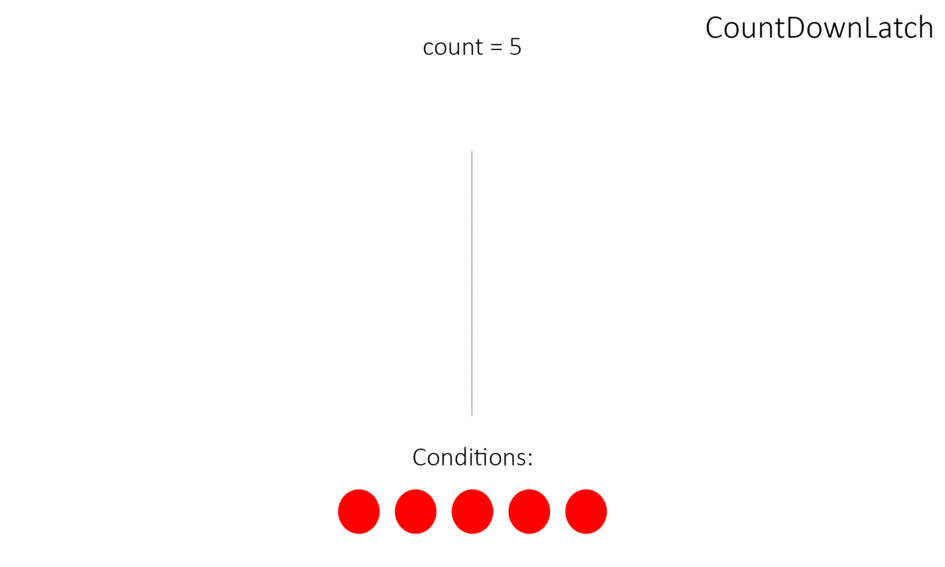

CountDownLatch (замок с обратным отсчетом) предоставляет возможность любому количеству потоков в блоке кода ожидать 
до тех пор, пока не завершится определенное количество операций, выполняющихся в других потоках, 
перед тем как они будут «отпущены», чтобы продолжить свою деятельность. 
В конструктор CountDownLatch (CountDownLatch(int count)) обязательно передается количество операций, 
которое должно быть выполнено, чтобы замок «отпустил» заблокированные потоки.

Блокировка потоков снимается с помощью счётчика: 
любой действующий поток, при выполнении определенной операции уменьшает значение счётчика. 
Когда счётчик достигает 0, все ожидающие потоки разблокируются и продолжают выполняться 
(примером CountDownLatch из жизни может служить сбор экскурсионной группы: 
пока не наберется определенное количество человек, экскурсия не начнется).

Possible usages in real time applications

1. **Achieving Maximum Parallelism** : 
Sometimes we want to start a number of threads at the same time to achieve maximum parallelism. 
For example, we want to test a class for being singleton. 
This can be done easily if we create a CountDownLatch with initial count 1, and make wait all threads to wait of latch. 
A single call to countDown() method will resume execution for all waiting threads in same time.
2. **Wait N threads to completes before start execution**: 
For example an application start-up class want to ensure that all N external systems are Up and running 
before handling the user requests.
3. **Deadlock detection**: 
A very handy use case in which you can use N threads to access a shared resource with different number of threads 
in each test phase, and try to create a deadlock.