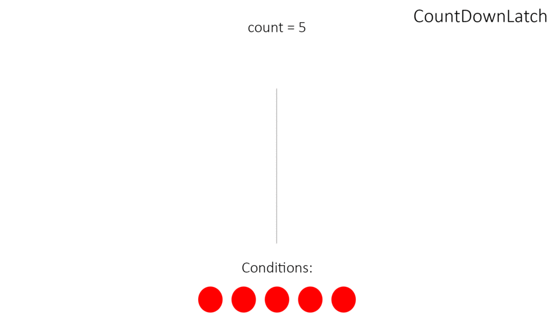

CountDownLatch (замок с обратным отсчетом) предоставляет возможность любому количеству потоков в блоке кода ожидать 
до тех пор, пока не завершится определенное количество операций, выполняющихся в других потоках, 
перед тем как они будут «отпущены», чтобы продолжить свою деятельность. 
В конструктор CountDownLatch (CountDownLatch(int count)) обязательно передается количество операций, 
которое должно быть выполнено, чтобы замок «отпустил» заблокированные потоки.

Блокировка потоков снимается с помощью счётчика: 
любой действующий поток, при выполнении определенной операции уменьшает значение счётчика. 
Когда счётчик достигает 0, все ожидающие потоки разблокируются и продолжают выполняться 
(примером CountDownLatch из жизни может служить сбор экскурсионной группы: 
пока не наберется определенное количество человек, экскурсия не начнется).